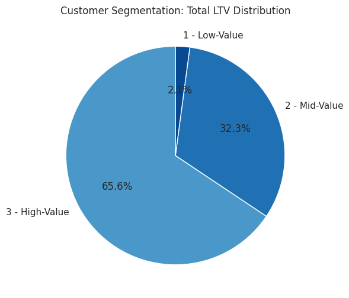
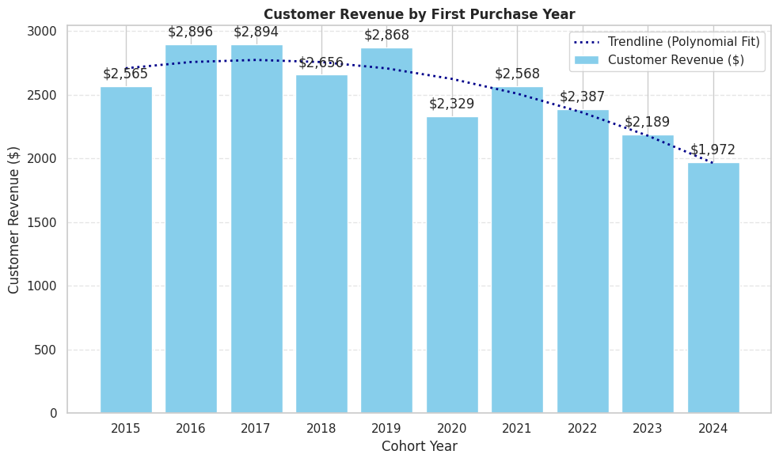
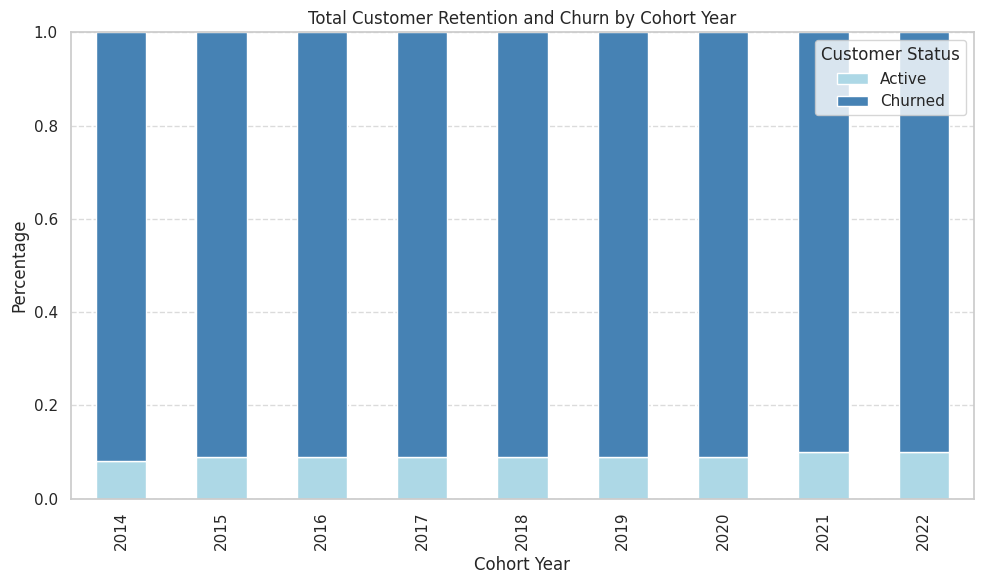

# SQL - Sales Analysis 

## Overview
Analysis of customer behavior, retention, and lifetime value for an e-commerce company toimprove customer retention and maximize revenue.

## Business Questions
1. **Customer Segmentation:** Who are the most valuable customers?
2. **Cohort Analysis:** How do different customer groups generate revenue?
3. **Retention Analysis:** Which customers haven't purchased recently?

## Analysis Approach

### 1. Customer Segmentation
- Categorized customers based on total lifetime value (LTV)
- Assigned customers to High, Mid, and Low-value segments
- Calculated key metrics: total revenue

Query: [1_customer_segmentation](/Scripts/1_customer_segmentation.sql)

**Visualization:**

**Key Findings:**
- High-value segment (25% of customers) drives 66% of revenue ($135.4M)
- Mid-value segment (50% of customers) drives 32% of revenue ($66.6M)
- Low-value segment (25% of customers) drives 2% of revenue ($4.3M)

**Business Insights:**
- High-Value (66% revenue): Offer premium mempership program to 12,372 VIP customers, as losing one customer significantly impacts revenue
- Mid-Value (32% revenue): Create upgrade paths through personalized promotion potential $66.6M -> 135.4M revenue opportunity
- Low-Value (2% revenue): Design re-engagement campaigns and price-sensitive promotions to increase purchase frequency

### 2. Cohort Analysis
- Tracked revenue and customer count per cohorts
- Cohorts were grouped by year of first purchase
- Analyzed customer retention at a cohort level

Query:
[2_cohort_analysis.sql](/Scripts/2_cohortanalysis.sql)

**Visualization:**

**Key Findings:**
- Revenue per customer shows an alarming decreasing trend over time
    -2022-2024 cohorts are consistently performing worse than earlier cohorts
    -NOTE: Although net revenue is increasing, this is likely due to a larger customer base, which is not reflective of customer value

**Business Insights:**
    - Value extracted from customers is decreasing over time and needs further investigation.
    - In 2023 we saw a drop in number of customers acquired, which is concerning.
    - With both loweing LTV and decreasing customer acquistion, the company is facing a potential revenue decline.

### 3. Customer Retention
- Identified customers at risk of churning
- Analyzed last purchase patterns
- Calucalted customer-specific metrics
Query:[3_retention_analysis.sql](/Scripts/3_rentention_analysis.sql)

**Visualization:**

**Key Findings:**
- Cohort churn stabilizes at ~90% after 2-3 years, indicating a predictable long-term retention pattern.
- Retention rates are consistenly low (8-10%) across all cohorts, suggesting retention issues are systemic rather than specific to certain years.
- Newer cohorts (2022-2023) show similar churn trajectories, signaling that without intervention, future cohorts will follow the same patterns.

**Business Insights:**
- Strengthen early engagement strategies to target the first 1-2 years with onboarding incentives, loyalty rewards, and peresonalized offers to improve long-term retention.
- Re-engage high-value churned customers by focusing on targted win-back campaigns rather than broad retention efforts, as reactiving valuble users may yield higher ROI.
- Predict & preempt churn risk and use customer-specific warning indicators to proactively intervene with at-risk customers before they lapse.

## Strategic Recommendations

1. **Customer Value Optimization** (Customer Segmentation)
- Launch VIP program for 12,372 high-value customers (66% of revenue)
- Create presonalized upgrade paths for mid-value segment ($66.6M -> $135.4M opportunity)
- Design price-sensitive promotions for low-value segment to increase purchase frequency

2. **Cohort Performance Strategy** (Customer Revenue by Cohort)
- Target 2022-2024 cohorts with personalized re-engagement offers
- Implement loyalty/subscription programs to stablize revenue fluctuations
- Apply successful strategies from high-spending 2016-2018 cohorts to newer customers

3. **Retention & Churn Prevention** (Customer Retention)
- Strengthen first 1-2 year engagement with onboarding incentives and loyalty rewards
- Focus on targeted win-back campaigns for high-value churned customers
- Implement proactive intervention system for at-risk customers before they lapse

## Technical Details
- **Database:** PostgreSQL
- **Analysis Tools:** PostgreSQL
- **Visualization:** ChatGPT